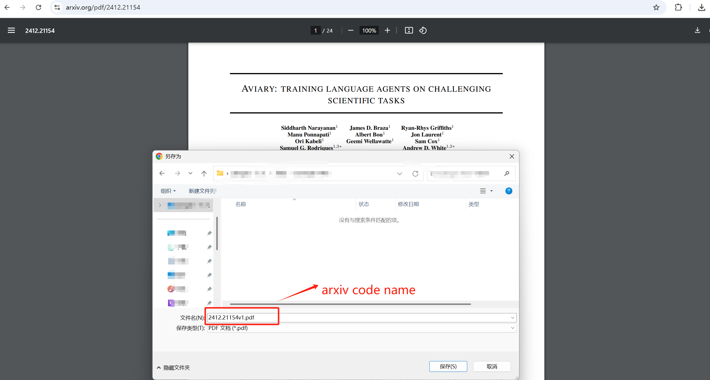
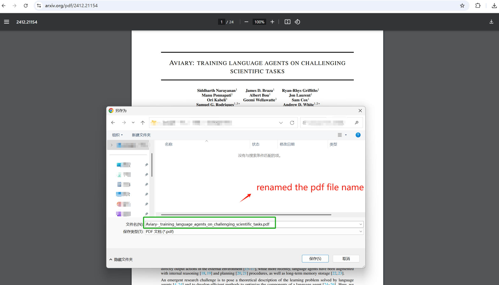
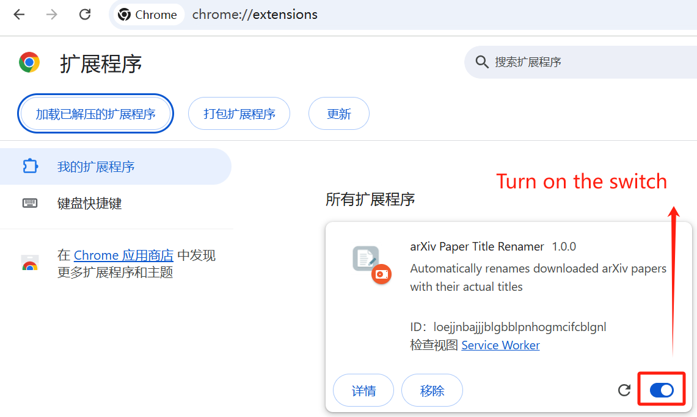
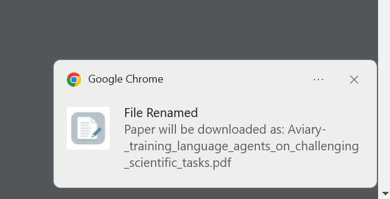

# arXiv Paper Title Renamer

> A Chrome extension that automatically renames downloaded arXiv papers to their actual titles.

<div align="center">

[](https://github.com/ChristopheZhao/arxiv-paper-renamer/releases)
[](LICENSE)


</div>

## Before & After

<table>
<tr>
<th>Before</th>
<th>After</th>
</tr>
<tr>
<td width="50%">

</td>
<td width="50%">

</td>
</tr>
</table>

When downloading a paper from arXiv, instead of a filename like `https://arxiv.org/pdf/2412.21154`, you'll get the actual paper title, like `Aviary-_training_language_agents_on_challenging_scientific_tasks.pdf`.

## Features

- 🚀 **Zero-Click Operation**: Works automatically when downloading papers
- 📝 **Smart Renaming**: Uses actual paper titles instead of arXiv IDs
- ✨ **Clean Filenames**: Properly formatted and sanitized filenames
- 🔄 **Real-time Processing**: Instant renaming during download
- 📚 **Universal Support**: Works with all arXiv papers

## Installation

### Method 1: Easy Install (Recommended)
1. Download the latest release from our [Releases Page](https://github.com/yourusername/arxiv-paper-renamer/releases)
2. Unzip the downloaded file
3. Open Chrome and go to `chrome://extensions/`
4. Enable "Developer mode" in the top right
5. Click "Load unpacked" and select the unzipped folder

<details>
<summary>See installation screenshots</summary>



</details>

### Method 2: Build from Source
```bash
# Clone the repository
git clone https://github.com/yourusername/arxiv-paper-renamer.git

# Navigate to the extension directory
cd arxiv-paper-renamer/src

# Then follow steps 3-5 from Method 1
```

## Usage

1. Visit any arXiv PDF page (e.g., https://arxiv.org/pdf/2412.21154)
2. The extension will automatically:
   - Detect the paper
   - Extract its title
   - Rename the downloaded PDF
3. You'll see a notification on the top right of the screen when the file has been renamed



No configuration needed - it just works! 🎉


## How It Works

The extension:
1. Detects when you're downloading an arXiv PDF
2. Fetches the paper's title from its abstract page
3. Sanitizes the title for use as a filename
4. Automatically renames the downloaded file

## Development

### Prerequisites
- Chrome Browser
- Basic understanding of JavaScript and Chrome Extensions

### Local Development
1. Clone the repository
```bash
git clone https://github.com/yourusername/arxiv-paper-renamer.git
cd arxiv-paper-renamer
```

2. Make your changes in the `src` directory

3. Test your changes:
   - Open Chrome Extensions page
   - Enable Developer mode
   - Load unpacked extension from `src` directory

### Project Structure
```
src/
├── manifest.json    # Extension configuration
├── background.js    # Background service worker
├── content.js       # Content script
└── icons/          # Extension icons
```

## Contributing

Contributions are always welcome! Please follow these steps:

1. Fork the repository
2. Create a feature branch
```bash
git checkout -b feature/amazing-feature
```
3. Commit your changes
```bash
git commit -m 'Add amazing feature'
```
4. Push to your branch
```bash
git push origin feature/amazing-feature
```
5. Open a Pull Request

## License

This project is licensed under the MIT License - see the [LICENSE](LICENSE) file for details.

## Acknowledgments

- Thanks to arXiv for their excellent repository of research papers
- Built with Chrome Extension APIs

---
If you find this extension useful, please consider giving it a star ⭐

[Add project logo or additional screenshots here]