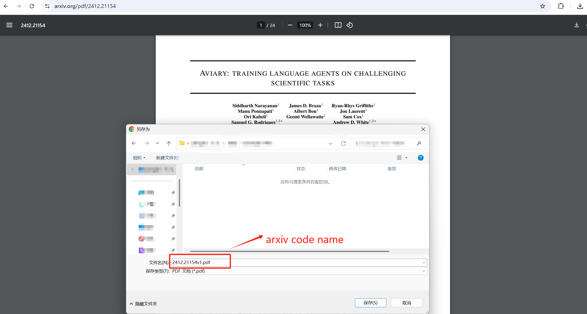

# arXiv 论文标题重命名器

> 一个 Chrome 扩展，可以自动将下载的 arXiv 论文重命名为其实际标题。

<div align="center">

[](https://github.com/yourusername/arxiv-paper-renamer/releases)
[](LICENSE)


</div>

## 效果对比

<table>
<tr>
<th>使用前</th>
<th>使用后</th>
</tr>
<tr>
<td width="50%">

</td>
<td width="50%">

</td>
</tr>
</table>

从 arXiv 下载论文时，文件名将从类似 `2412.17799v1.pdf` 的格式变为论文的实际标题，如 `Universal_In_Context_Image_Generation_in_Auto_Regressive_Vision_Language_Models.pdf`。

## 特性

- 🚀 **全自动操作**：下载时自动重命名，无需手动干预
- 📝 **智能重命名**：使用论文实际标题，而不是 arXiv ID
- ✨ **规范文件名**：自动处理特殊字符，生成规范的文件名
- 🔄 **实时处理**：下载时即时重命名
- 📚 **通用支持**：支持所有 arXiv 论文

## 安装

### 方式一：简单安装（推荐）
1. 从 [Releases 页面](https://github.com/yourusername/arxiv-paper-renamer/releases) 下载最新版本
2. 解压下载的文件
3. 打开 Chrome，访问 `chrome://extensions/`
4. 在右上角启用"开发者模式"
5. 点击"加载已解压的扩展程序"，选择解压后的文件夹

<details>
<summary>查看安装截图</summary>


</details>

### 方式二：从源码安装
```bash
# 克隆仓库
git clone https://github.com/yourusername/arxiv-paper-renamer.git

# 进入扩展目录
cd arxiv-paper-renamer/src

# 然后按照方式一的步骤 3-5 操作
```

## 使用方法

1. 访问任意 arXiv PDF 页面（例如：https://arxiv.org/pdf/2412.17799v1.pdf）
2. 扩展会自动：
   - 检测论文
   - 提取标题
   - 重命名 PDF 文件
3. 下载时会看到重命名通知


无需任何配置 - 即装即用！🎉

## 工作原理

本扩展：
1. 检测到 arXiv PDF 下载时
2. 从论文摘要页面获取标题
3. 处理标题使其适合作为文件名
4. 自动重命名下载的文件

## 开发

### 环境要求
- Chrome 浏览器
- 基本的 JavaScript 和 Chrome 扩展开发知识

### 本地开发
1. 克隆仓库
```bash
git clone https://github.com/yourusername/arxiv-paper-renamer.git
cd arxiv-paper-renamer
```

2. 在 `src` 目录中修改代码

3. 测试修改：
   - 打开 Chrome 扩展页面
   - 启用开发者模式
   - 加载已解压的扩展

### 项目结构
```
src/
├── manifest.json    # 扩展配置文件
├── background.js    # 后台服务工作进程
├── content.js       # 内容脚本
└── icons/          # 扩展图标
```

## 贡献代码

欢迎贡献代码！请遵循以下步骤：

1. Fork 本仓库
2. 创建功能分支
```bash
git checkout -b feature/amazing-feature
```
3. 提交更改
```bash
git commit -m '添加新功能'
```
4. 推送到分支
```bash
git push origin feature/amazing-feature
```
5. 创建 Pull Request

## 许可证

本项目采用 MIT 许可证 - 详见 [LICENSE](../LICENSE) 文件。

## 致谢

- 感谢 arXiv 提供优质的论文仓库
- 使用 Chrome Extension APIs 构建

---
如果觉得这个扩展有用，欢迎给个 star ⭐